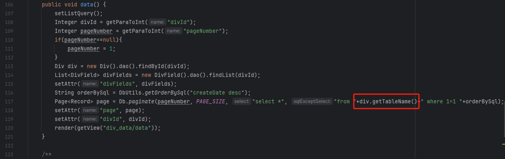
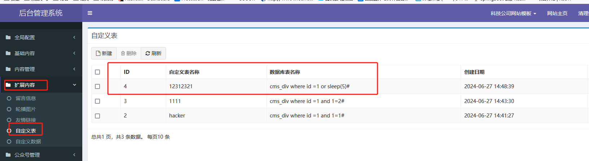
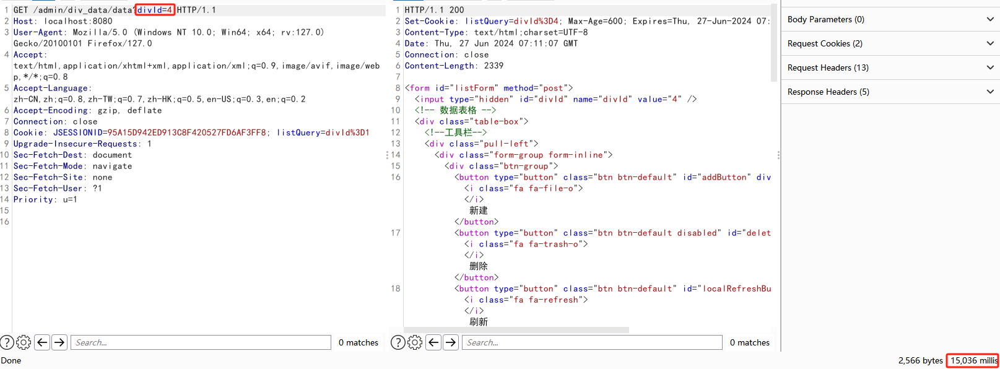
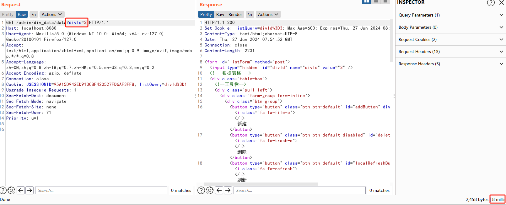

JFinalCMS v5.0.0 is vulnerable to SQL injection via /admin/div_data/data

Build the source code locally by downloading https://gitee.com/heyewei/JFinalcms

The vulnerable code location is com/cms/controller/admin/DivDataController#data

This code obtains a Div object through the divId parameter, and calls the getTableName method to obtain the tableName of the object. We can custom create a div object and add malicious statements to the tableName

The vulnerability exists: http://127.0.0.1:8080/admin/div_data/data

The username and password : admin/123456

We first create a custom div object and set the malicious statement in the tableName field

**cms_div where id =1 or sleep(5)#**

Then we visit the address http://127.0.0.1:8080/admin/div_data/data?divId=4

10 second delay with injection present

While the divId=3,only 8 millis delay

